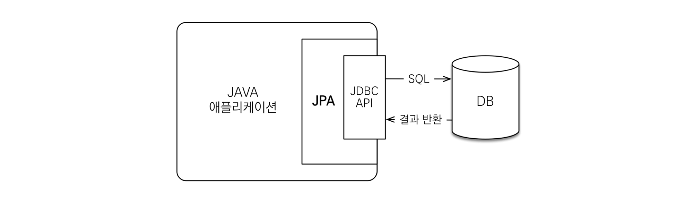

# Entity Class

---

1. 실제 DB의 테이블과 1 : 1로 매핑 되는 클래스
    - 테이블과 링크될 클래스
    - 상속받거나 구형체여서는 안되며 테이블 내에 존재하지 않는 컬럼을 가져서도 안된다
    - Entity Class or 가장 Core한 클래스 라고 부른다
    - @Entity, @Column, @Id등을 이용한다
2. 최대한 외부에서 Entity클래스의 getter 메소드를 사용하지 않도록 해당 클래스 안에서 필요한 로직 method를 구현한다
    - Domain Logic만 가지고 있어야 한다
    - Presentation Logic을 가지고 있으면 안된다
    - 구현한 method는 주로 Service Layer에서 사용한다
3. Entity클래스와 DTO 클래스를 분리하는 이유
    - View Layer와 DB Layer의 역할을 철저하게 분리하기 위함이다
    - 테이블과 링크되는 Entity Class가 변경되면 여러 클래스에 영향을 미치기 때문
    - Domain Model을 아무리 잘 설계해도 각 View안에서 getter만을 이용해 정보를 표현하기 어려울 때 필드나 로직을 추가하게 되는데 이런 방식이 모델링의 순수성을 깨고 객체를 망가뜨리게 된다
    - Domain Model을 복잡하게 조합한 형태의 Presentaion 요구 사항들이 있기 때문에 Domain Model을 직접 사용하는것은 어렵다

# DAO (Data Access Object)

---

1. repository package
    - 실제로 DB에 접근하는 객체이다
        - DB에 데이터를 CRUD하는 계층(Persistence Layer)이다
    - 서버와 DB를 연결하는 고리의 역할을 한다
    - SQL을 사용하여 DB에 접근한 후 적절한 API를 제공한다
        - JPA에서는 기본적인 CRUD method를 제공하고 있다

# ORM (Object-relational mapping)

---

- Object-relational mapping (객체 관계 매핑)
    - 객체는 객체대로 설계한다
    - 관계형 데이터베이스는 관계형 데이터베이스대로 설계한다
    - 프레임 워크가 중간에서 매핑해준다
- 대중적인 언어에는 대부분 ORM기술이 존재한다
- ORM은 객체와 RDB 두 기둥 위에 있는 기술이다
1. EJB
    - 과거의 자바 표준 (Entity Bean)
    - 과거의 ORM
    - 코드가 매우 지저분하다는 문제
    - API의 복잡성이 높다 (interface를 많이 구현해야 함)
    - 속도가 느리다
2. Hibernate
    - ORM프레임워크, Open Source SW
    - EJB2 스타일의 Entity Beans이용을 대체할 목적으로 개발
3. JPA (Java Persistence API)
    - 자바 진영의 ORM기술 표준으로, 인터페이스의 모음이다
        - 실제로 동작하는 것이 아니다
        - JPA 인터페이스를 구현한 대표적인 오픈소스가 Hibernate라고 할 수 있다.

# JPA (Java Persistence API)

---

- JPA 동작 과정

- 개발자가 JPA를 사용하면 JPA 내부에서 JDBC API를 사용하여 SQL을 호출하여 DB와 통신
1. INSERT

    

    1. Meber 엔티티 분석
    2. INSERT SQL 생성
    3. JDBC API를 이용하여 SQL을 DB에 날림
2. Find

    

    1. 엔티티의 매핑 정보를 바탕으로 적절한 SELECT SQL 생성
    2. JDBC API를 이용하여 SQL을 DB에 날림
    3. DB에서 결과를 받아옴
    4. 결과를 객체에 모두 매핑
- 특징
    - 데이터를 객체지향적으로 관리할 수 있기 때문에 비즈니스 로직에 집중할 수 있고, 객체지향 개발이 가능
    - 자바 객체와 DB테이블 사이의 매핑 설정을 통해 SQL을 생성
    - 객체를 통해 쿼리를 작성할 수 있는 JPQL을 지원
    - JPA는 성능 향상을 위해 지연로딩이나 즉시 로딩과 같은 몇가지 기법을 제공 - 이를 활용하면 SQL을 직접 사용하는 것과 같은 유사한 성능을 얻을 수 있음
- JPA를 왜 사용해야 할까
    - SQL 중심적인 개발 → 객체 중심적인 개발 가능
    - 생산성이 증가 (간단한 메소드로 CRUD 가능)
    - 유지보수가 쉽다
    - Object와 RDB간의 패러다임 불일치 해결